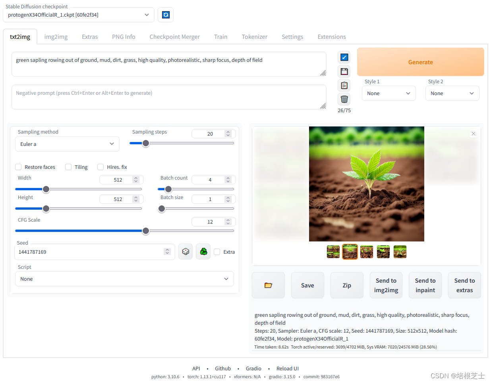

`Stable-Diffusion-Webui` 是一个基于 `Gradio` 库的 `Stable Diffusion` 的浏览器界面，可以说是 `AI 绘画`集合体，支持目前主流的开源 AI 绘画模型，例如 `NovelAi/Stable Diffusion`，有了它，我们就可以很方便地配置和生成 AI 绘画作品，并且进行各种精细地配置。

一、搭建指南
------

1、安装 `Python 3.10.6` 和 `git`

2、下载 `stable-diffusion-webui` 源码

```
git clone https://github.com/AUTOMATIC1111/stable-diffusion-webui.git
```

3、将模型文件放在项目根目录下的 models/Stable-diffusion 文件夹里

4、运行`webui-user.bat` 启动

5、在浏览器中输入 [http://127.0.0.1:7860](http://127.0.0.1:7860 "http://127.0.0.1:7860") 打开 SD 页面



`launch.py` 可自动运行模型，运行时可以使用一些命令参数，比如：

```
python launch.py --opt-split-attention --ckpt model.ckpt
```

**命令行参数和优化：**

<table><thead><tr><th>命令行参数</th><th>解释</th></tr></thead><tbody><tr><td><code>--share</code></td><td>online 运行，也就是 public address</td></tr><tr><td><code>--listen</code></td><td>使服务器侦听网络连接。这将允许本地网络上的计算机访问 UI。</td></tr><tr><td><code>--port</code></td><td>更改端口，默认为端口 7860。</td></tr><tr><td><code>--xformers</code></td><td>使用 xformers 库。极大地改善了内存消耗和速度。Windows 版本安装由 C43H66N12O12S2 维护的二进制文件</td></tr><tr><td><code>--force-enable-xformers</code></td><td>无论程序是否认为您可以运行它，都启用 xformers。不要报告你运行它的错误。</td></tr><tr><td><code>--opt-split-attention</code></td><td>Cross attention layer optimization 优化显着减少了内存使用，几乎没有成本（一些报告改进了性能）。黑魔法。默认情况下 torch.cuda，包括 NVidia 和 AMD 卡。</td></tr><tr><td><code>--disable-opt-split-attention</code></td><td>禁用上面的优化</td></tr><tr><td><code>--opt-split-attention-v1</code></td><td>使用上述优化的旧版本，它不会占用大量内存（它将使用更少的 VRAM，但会限制您可以制作的最大图片大小）。</td></tr><tr><td><code>--medvram</code></td><td>通过将稳定扩散模型分为三部分，使其消耗更少的 VRAM，即 cond（用于将文本转换为数字表示）、first_stage（用于将图片转换为潜在空间并返回）和 unet（用于潜在空间的实际去噪），并使其始终只有一个在 VRAM 中，将其他部分发送到 CPU RAM。降低性能，但只会降低一点 - 除非启用实时预览。</td></tr><tr><td><code>--lowvram</code></td><td>对上面更彻底的优化，将 unet 拆分成多个模块，VRAM 中只保留一个模块, 破坏性能</td></tr><tr><td><code>*do-not-batch-cond-uncond</code></td><td>防止在采样过程中对正面和负面提示进行批处理，这基本上可以让您以 0.5 批量大小运行，从而节省大量内存。降低性能。不是命令行选项，而是使用–medvramor 隐式启用的优化–lowvram。</td></tr><tr><td><code>--always-batch-cond-uncond</code></td><td>禁用上述优化。只有与–medvram 或–lowvram 一起使用才有意义</td></tr><tr><td><code>--opt-channelslast</code></td><td>更改 torch 内存类型，以稳定扩散到最后一个通道，效果没有仔细研究。</td></tr></tbody></table>

完整的命令行参数详见：

[https://github.com/AUTOMATIC1111/stable-diffusion-webui/wiki/Command-Line-Arguments-and-Settings](https://github.com/AUTOMATIC1111/stable-diffusion-webui/wiki/Command-Line-Arguments-and-Settings)

二、主要功能
------

`WebUI` 分为以下几个模块：

*   `txt2img` --- 标准的文字生成图像
*   `img2img` --- 根据图像成文范本、结合文字生成图像
*   `Extras` --- 优化 (清晰、扩展) 图像
*   `PNG Info` --- 图像基本信息
*   `Checkpoint Merger` --- 模型合并
*   `Train` --- 训练模型
*   `Settings` --- 默认参数修改

### txt2img（文转图）

**prompt**：对于图像进行描述，有内容风格等信息进行描述。

**Negative prompt**：提供给模型我不想要什么样的风格

**Sampling Steps**：`diffusion model` 生成图片的迭代步数，每多一次迭代都会给 AI 更多的机会去比对 `prompt` 和当前结果，去调整图片。更高的步数需要花费更多的计算时间，但不一定意味着更好的结果。当然迭代步数不足（少于 50）肯定会降低结果的图像质量；

**Sampling method**：扩散去噪算法的采样模式，不同的采样模式会带来不一样的效果

**Width、Height**：图像长宽，可以通过 `send to extras` 进行扩大，所以这里不建议设置太大 [显存小的特别注意]；

**Restore faces**：优化面部，绘制面部图像特别注意

**Tiling**：生成一个可以平铺的图像

**Highres. fix**：使用两个步骤的过程进行生成，以较小的分辨率创建图像，然后在不改变构图的情况下改进其中的细节，选择该部分会有两个新的参数 **Scale、latent** 在潜空间中对图像进行缩放。另一种方法是从潜在的表象中产生完整的图像，将其升级，然后将其移回潜在的空间。**Denoising strength** 决定算法对图像内容的保留程度。为 0 时，什么都不会改变，而为 1 时，你会得到一个不相关的图像；

**Batch count、 Batch size**：都是生成几张图，前者计算时间长，后者需要显存大；

**CFG Scale**：分类器自由引导尺度——图像与提示符的一致程度——越低的值产生越有创意的结果；

**Seed**：种子，只要种子值一样，参数一致、模型一样图像就能重新

### img2img（图转图）

**Just resize、 Crop and resize、 Resize and fill**：这三种模式保证图输出效果，因为下面会有新的尺寸，分别表示只需调整大小、裁剪和调整大小、调整大小和填充。

**Denoising strength**：与原图一致性的程度，一般大于 0.7 出来的都是新效果，小于 0.3 基本就会原图缝缝补补；

### Extras（更多）

对图片进行优化缩放

**GFPGAN visibility**：对图像清晰度进行优化