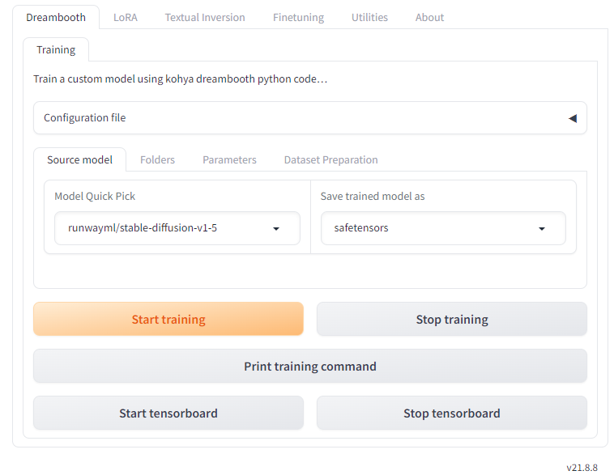
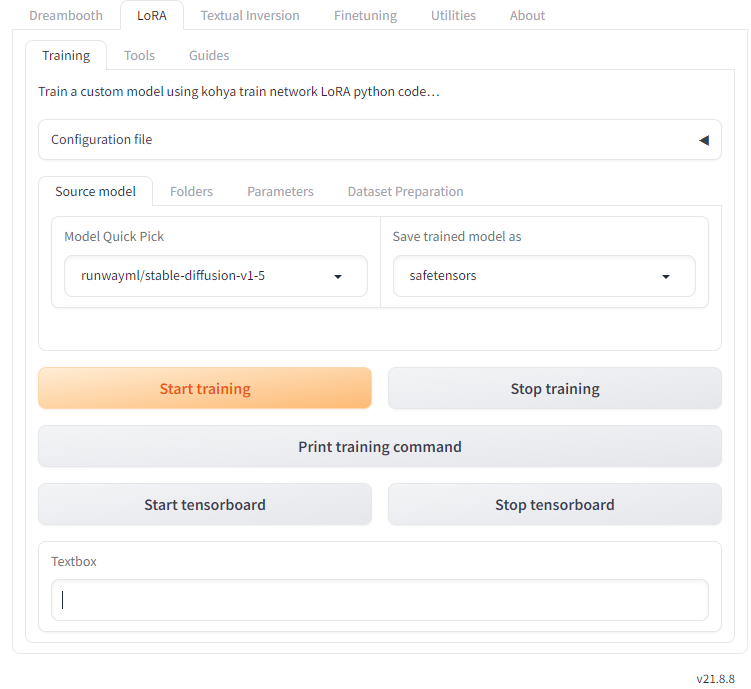
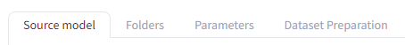
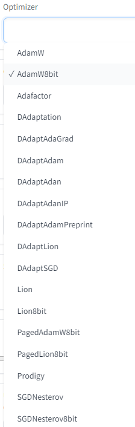
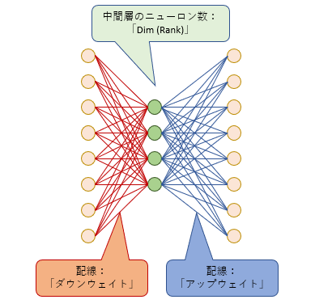
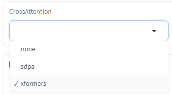

> 在以前的文章中，我解释了kohya_ss的每个参数。

我并非有意将这篇文章写成面向广大公众的有益信息，但最近访问这篇文章的人数有所增加。因此，我在想可能存在需求，然而，考虑到 kohya_ss 最新版本的显著进展，写于数月前的这篇文章可能包含一些过时的信息。

因此，本次我打算对自上一版本以来 kohya_ss 发生变化的部分进行補充解释。

本次解释的 kohya_ss 版本是 **v21.8.8**。

### kohya_ss 的基本界面

下面的画面是启动 kohya_ss 时显示的基本界面。可以看到 kohya_ss 的各个功能都被整理到不同的标签中。

版本号始终显示在右下角。

kohya_ss 的基本界面

让我们看一下最顶部的标签组。

#### 追加学习标签

kohya_ss 提供了使用 **Dreambooth**、**LoRA**、**Textual Inversion** 和 **Finetuning** 这 4 种方法进行追加学习。这 4 种追加学习设置分别独立整理在不同的标签中。

目前，LoRA 学习是主流，因此大多数人可能会选择第二个标签从左边数过来的「LoRA」标签。因此，在本文中将仅解释「LoRA」标签。

#### Utilities 标签

在「Utilities」标签下，提供了用于「准备学习图像」的工具以及用于「处理、转换和输出预训练模型」的工具。

如果要将kohya_ss作为追加学习工具使用，那么「将图像按大小整理」、「在学习图像上添加标题」等学习图像准备工具可能会经常使用。

在本文中，我将不解释有关实用工具的内容。

#### About 标签

这是帮助页面。版本信息也会显示在顶部。

这里提供了关于安装、更新和启动的详细帮助。然而，如果您正在查看这个帮助页面，那么可能已经安装了 kohya_ss，所以可能不需要继续阅读。

此外，还简要介绍了有关每个追加学习的解释视频和外部链接。

### LoRA 标签内的结构

在本文中，将仅解释「LoRA」标签内的内容。

"LoRA"标签的内容

在"LoRA"标签内，进一步分为"Training"、"Tools"和"Guides"这三个子标签。

#### Training 标签

"Training" 标签是追加学习设置的主体。在这里，您可以设置所有主要参数并进行学习。这里的大多数参数已经在[先前的文章](https://hoshikat.hatenablog.com/entry/2023/05/26/223229)中进行了解释，但新添加的参数将在后面进行说明。

#### Tools 标签

* 在这里，您可以提取或合并 LoRA 文件和 LyCORIS 文件。由于这些工具主要用于 LoRA 学习后的操作，因此在进行学习之前通常不需要。

  然而，在 "Dataset Preparation" 标签下，提供了两个工具，用于学习准备：

  - 「Folder preparation」：自动创建、命名和整理学习图像的特殊文件夹结构的功能。此功能不会更改图像本身。
  - 「Dataset balancing」：为了确保每个概念的图像都以几乎相同的步数进行学习，自动计算学习步数。例如，如果“概念 1”文件夹有 20 张图像，“概念 2”文件夹有 40 张图像，那么将确保“概念 1”文件夹的重复学习次数是“概念 2”文件夹的两倍。

#### Guides 标签

在这里，将添加执行 LoRA 学习和开发的指南。目前，只有关于学习的一些指南被简要提及。

### Training 标签内的结构

终于，让我们看一下 LoRA 学习的主体，即「Training」标签。这里有进一步的 4 个子标签。这与之前的文章时差不多有相同的结构。

LoRA 的 Training 标签内的子标签。

值得注意的是，「Dataset Preparation」标签的内容与上方的「Tools」标签内的「Dataset Preparation」标签的内容完全相同。

#### Source model 标签的变更点

在 "Source model 标签" 中，新增了 "SDXL Model" 选项。这是在版本 2 之后的最新版本，Stable Diffusion 的结构也发生了重大变化。使用 SDXL 模型时，请务必将其打开。

#### Folders 标签的变更点

Folders 标签内的参数自以前没有更改

#### "Parameters 标签的变更点

"Parameters 便签内的参数被进一步整理为「Basic」「Advanced」「Samples」三个标签。有些参数的位置发生了变化，但功能仍然相同。

在这里，仅解释添加的参数。"

##### Max train steps

这个选项与 "Max train epoch" 类似。

通常，步数由图像数量、重复次数和时代数决定，但您也可以在这里指定上限步数。一旦达到指定的步数，学习将强制结束。

默认值为空。如果不需要限制步数，可以保持为空。

##### Optimizer

[优化器](https://d.hatena.ne.jp/keyword/%A5%AA%A5%D7%A5%C6%A5%A3%A5%DE)是指关于“在学习过程中如何更新[神经网络](https://d.hatena.ne.jp/keyword/%A5%CB%A5%E5%A1%BC%A5%E9%A5%EB%A5%CD%A5%C3%A5%C8)权重”的设置。与以前的文章相比，[优化器](https://d.hatena.ne.jp/keyword/%A5%AA%A5%D7%A5%C6%A5%A3%A5%DE)的数量增加了，但基本上使用“AdamW”或“AdamW8bit”就足够了，没有问题。

以下是新增的[优化器](https://d.hatena.ne.jp/keyword/%A5%AA%A5%D7%A5%C6%A5%A3%A5%DE)：

- DAdaptadanIP
- DAdaptAdamPreprint
- DAdaptLion
- PagedAdamW8bit
- PagedLion8bit
- [Prodigy](https://d.hatena.ne.jp/keyword/Prodigy)

其中，「Paged」[优化器](https://d.hatena.ne.jp/keyword/%A5%AA%A5%D7%A5%C6%A5%A3%A5%DE)是一种具有防止在学习过程中发生突发内存不足错误的功能的优化器，而 [Prodigy](https://d.hatena.ne.jp/keyword/Prodigy) 是最近提出的「DAdapt」变体的改进版本，据报道比「DAdapt」更快速、更准确地收敛。

您可以在这里以命令的形式添加调度程序的附加设置，留空也是可以的。

##### Minimum [bucket](https://d.hatena.ne.jp/keyword/bucket) resolution

##### Maximum [bucket](https://d.hatena.ne.jp/keyword/bucket) resolution

这两个选项只在 "Enable buckets" 被选中时生效。

"Bucket" 是指将学习图像按大小分类放入的容器。LoRA 可以混合不同分辨率的图像进行学习，但使用这两个选项可以指定最小和最大图像尺寸。这两者都不能指定小于 64 [像素](https://d.hatena.ne.jp/keyword/%A5%D4%A5%AF%A5%BB%A5%EB) 的数字。

##### 关于Weight norms和Dropout选项的先前知识

LoRA 是添加到原始模型的小型[神经网络](https://d.hatena.ne.jp/keyword/%A5%CB%A5%E5%A1%BC%A5%E9%A5%EB%A5%CD%A5%C3%A5%C8)（有关详细信息，请参阅[先前的文章](https://hoshikat.hatenablog.com/entry/2023/05/26/223229)）。这个小型[神经网络](https://d.hatena.ne.jp/keyword/%A5%CB%A5%E5%A1%BC%A5%E9%A5%EB%A5%CD%A5%C3%A5%C8)被添加到原始模型（确切地说是 U-Net 结构）的各个位置，总共有几十个。这个称为“小型[神经网络](https://d.hatena.ne.jp/keyword/%A5%CB%A5%E5%A1%BC%A5%E9%A5%EB%A5%CD%A5%C3%A5%C8)”的东西在这里方便地被称为“模块”。

LoRA 模块由 "Down-weight"、"Rank" 和 "Up-weight" 组成。这里的 "Rank" 是指中间层[神经元](https://d.hatena.ne.jp/keyword/%A5%CB%A5%E5%A1%BC%A5%ED%A5%F3)的数量。

考虑到这些，让我们看看以下三个选项：

1. **Dropout（丢弃）：** 这是一个选项，它在每个训练步骤中以固定概率关闭此模块的一部分或全部。关闭的部分不执行任何操作，也不参与训练。

   这是防止“[过拟合](https://d.hatena.ne.jp/keyword/%B2%E1%B3%D8%BD%AC)”的技巧。"[过拟合](https://d.hatena.ne.jp/keyword/%B2%E1%B3%D8%BD%AC)" 指的是过度记住给定的训练图像，导致失去灵活性，只能生成类似于训练图像的图像。为了防止这种情况发生，有时对学习进行一定程度的“懈怠”是有效的。

这种技术有助于模型更好地泛化到未见过的数据，提高其性能。

##### Scale weight norms

LoRA 学習过程中，上述模块中的 "下降权重" 和 "上升权重" 的线条粗细会发生变化，但可以设定其最大粗细的上限。

整体线条的粗细可以用一个称为 "范数" 的数值来表示。通过将这个 "范数" 限制在一定范围内，可以防止特定线条过于粗细导致[过拟合](https://d.hatena.ne.jp/keyword/%B2%E1%B3%D8%BD%AC)，以及防止学习部分过于偏向某一方面。此外，预计在同时使用多个 LoRA 模块时，此功能也能够稳定发挥作用。

你可以设定一个介于 0 到 10 之间的值，以确定一个强有力的上限。数字越小，设定的上限就越强烈。

默认值为 0，当值为 0 时，此功能将被禁用。建议设置为 1。

值得注意的是，这个选项似乎与后面的 Dropout 结合使用时会发挥更好的效果。

##### Network dropout

这个选项用于以一定的概率对模块内的 "下降权重" 进行[Dropout（丢弃）](https://d.hatena.ne.jp/keyword/%A5%C9%A5%ED%A5%C3%A5%D7%A5%A2%A5%A6%A5%C8)（即切断连接）。取值范围为 0 到 1，值越大，[Dropout（丢弃）](https://d.hatena.ne.jp/keyword/%A5%C9%A5%ED%A5%C3%A5%D7%A5%A2%A5%A6%A5%C8) 的概率就越高。

默认值是 0。建议的范围是 0.1 到 0.5。

##### Rank dropout

这个选项是指以一定的概率对模块中间的[神经元](https://d.hatena.ne.jp/keyword/%A5%CB%A5%E5%A1%BC%A5%ED%A5%F3)进行[Dropout（丢弃）](https://d.hatena.ne.jp/keyword/%A5%C9%A5%ED%A5%C3%A5%D7%A5%A2%A5%A6%A5%C8)（即关闭），取值范围为 0 到 1，值越大，[Dropout（丢弃）](https://d.hatena.ne.jp/keyword/%A5%C9%A5%ED%A5%C3%A5%D7%A5%A2%A5%A6%A5%C8) 的概率就越高。

默认值是 0。建议的范围是 0.1 到 0.3。

##### Module dropout

这个选项是指以一定的概率完全禁用整个模块，也就是说，(在那一部分) LoRA 将完全无效。当然，即使一些模块被禁用，由于 U-Net 内有数十个模块，LoRA 学习并不会变得无用。取值范围为 0 到 1，值越大，[Dropout（丢弃）](https://d.hatena.ne.jp/keyword/%A5%C9%A5%ED%A5%C3%A5%D7%A5%A2%A5%A6%A5%C8) 的概率就越高。

默认值是 0。建议的范围是 0.1 到 0.3。

##### VAE

在这里，您可以指定用于学习的 VAE。如果此处留空，则VAE将使用模型数据（在Sourcd model选项卡中指定的数据）。

默认情况下为空。

##### Save last N steps state

此选项在“Save training state”为打开且“Save every N steps”不为0时才会生效。

在训练过程中，您可以保存中间状态。通过加载此状态文件，您可以从训练过程的中间状态继续进行。

保存的时机由“Save every N steps”指定。例如，如果“Save every N steps”为200，那么在第200步，400步，600步...每200步就会保存一次状态数据。

在“Save last N steps state”中，您可以指定要保留过去多少步的状态数据。

例如，如果“Save every N steps”为200，那么尝试将此选项指定为300。在第800步，实际上应该保存了200、400、600和800步时的状态，但由于指定了仅保留最近300步，因此在此之前（即在500步之前）的200、400步时的状态数据将被删除。

默认值为0，如果为0，则不会保存。

##### Full bf 16 training

这将使用bf16大小对所有权重数据进行训练。由于bf16是16位，相对于使用32位权重数据进行训练，这将节省内存。由于bf16是一种旨在尽可能保持32位精度的格式，如果内存不足，可以尝试使用它。

##### CrossAttention

以前是一个名为"use xformers"的选项。现在，除了xformers之外，还可以使用名为"sdpa"的算法。

两者都有“通过设计计算方法来节省内存或提高性能”的作用。

##### V Pred like loss

在训练时，学习图像不是直接加载的，而是在图像上添加了一些噪声（类似于沙尘）。现在，追加学习的目的是使神经网络能够生成与学习图像相似的图像。换句话说，希望创建一个能够完全去除噪声的神经网络，以便生成与学习图像相同的图像。

神经网络对输入图像执行各种处理，以“预测”添加的噪声。预测的噪声将与“实际”噪声进行比较，然后调整神经网络以使它们匹配。

预测噪声与实际噪声的差异称为“损失”。学习的目标是通过改变神经网络来最小化这个“损失”。

我们想要的是“图像”，而不是“噪声”。为了在较少的步骤中更好地生成这个“图像”，提出了一种学习方法，该方法预测了一种称为“v”的特殊值，而不是“噪声”。Stable Diffusion版本2系列基于这种“v预测”（v_parameterization）进行了模型训练。

将“V Pred like loss”选项设置为开启时，进行类似于“v预测”的学习。

默认情况下，此选项处于关闭状态。

##### Min Timestep

##### Max Timestep

学习图像如上所述，每次会在图像上随机添加一些噪声（类似于沙尘），噪声的强度是随机确定的。在 Stable Diffusion 中，噪声的强度用0到1000的数字表示，其中0表示没有噪声的状态，1000表示只有噪声的状态（即沙尘图像）。

这两个选项允许您确定添加噪声的强度范围（Min：最小，Max：最大）。

如果将最大噪声值设定为较小的值，那么训练后的 LoRA 在图像生成的初始阶段（充满噪声的状态）几乎不起作用，而是在图像浮现出一定程度的状态后才发挥其能力。这可能对创建用于图像到图像的 LoRA 有益。

默认情况下，Min为0，Max为1000。通常情况下，可以保持默认设置。

##### Scale v prediction loss

这是基于版本2系列模型的选项，该模型基于“v预测”（请参阅“V Pred like loss”）。

正如在“V Pred like loss”中所述，“学习”是指减小“损失”的过程。

当启用“Scale v prediction loss”时，此“损失”的值会被估计为比通常小。它的减小程度取决于训练图像上的噪声量，当有很多噪声时，它不会减小太多，而当噪声很少时，它会减小很多。

“损失”值较小时，[神经网络](https://d.hatena.ne.jp/keyword/%A5%CB%A5%E5%A1%BC%A5%E9%A5%EB%A5%CD%A5%C3%A5%C8)的变化不会太大。换句话说，当学习“有很多噪声的图像”时，[神经网络](https://d.hatena.ne.jp/keyword/%A5%CB%A5%E5%A1%BC%A5%E9%A5%EB%A5%CD%A5%C3%A5%C8)会被大幅修正，而当学习“几乎没有噪声的图像”时，它几乎不会被修正。kohya_ss解释说，通过此选项，大致的构图信息上的噪声和微观信息上的噪声的预测差异被补偿，从而提高了图像细节的质量。

但是，请注意，启用此选项可能会导致学习效率降低，可能需要提高学习率（Learning rate）。

默认情况下是关闭的。

### 总结

LoRA学习也在普及，数量和质量都有所提高，因此在kohya_ss中也添加了各种选项。当然，您可以设置许多参数来创建精细的LoRA，但即使将大多数参数保持默认值，也足以创建足够实用的LoRA。

首先，从简单的设置开始，熟悉之后，如果有兴趣，可以尝试更改参数。