> 上一篇文章介绍了添加学习 Stable Diffusion 模型的 WebUI 环境 "kohya_ss" 的方法。

在上一篇文章中，我们解释了添加学习 Stable Diffusion 模型的 WebUI 环境 "kohya_ss" 的方法。

这一次，我们将大致解释 LoRA 的原理，然后深入介绍使用 kohya_ss 进行 LoRA 学习设置。

请注意：这篇文章非常长！

**本文仅解释了“每个设置的含义”。**

关于“准备学习图像”的方法，以及“如何给图像添加标题”以及“如何执行学习”等方面的解释并没有包含在内。关于如何执行学习的方法，我打算在另一篇文章中进行解释。

### 了解 LoRA 的运作方式

要理解 kohya_ss 的每个设置的含义，首先需要了解 LoRA 是如何通过怎样的机制进行追加学习的。

我们还将解释“模型”作为追加学习的目标是什么。

#### 关于“模型”

Stable Diffusion 使用称为“**模型**”的模块。模型可以看作是“大脑”，其本质是“**神经网络的权重信息**”。

[神经网络](https://d.hatena.ne.jp/keyword/%A5%CB%A5%E5%A1%BC%A5%E9%A5%EB%A5%CD%A5%C3%A5%C8)由许多“**[神经元](https://d.hatena.ne.jp/keyword/%A5%CB%A5%E5%A1%BC%A5%ED%A5%F3)**”组成，而[神经元](https://d.hatena.ne.jp/keyword/%A5%CB%A5%E5%A1%BC%A5%ED%A5%F3)的集合形成了多层的“**层**”。一个层的[神经元](https://d.hatena.ne.jp/keyword/%A5%CB%A5%E5%A1%BC%A5%ED%A5%F3)与另一层的[神经元](https://d.hatena.ne.jp/keyword/%A5%CB%A5%E5%A1%BC%A5%ED%A5%F3)通过连接线相连，连接的强度由“**权重**”表示。这些“权重”保留了庞大的图像信息。

#### LoRA 添加小型[神经网络](https://d.hatena.ne.jp/keyword/%A5%CB%A5%E5%A1%BC%A5%E9%A5%EB%A5%CD%A5%C3%A5%C8)

LoRA 是“追加学习”的一种形式，追加学习是指对[神经网络](https://d.hatena.ne.jp/keyword/%A5%CB%A5%E5%A1%BC%A5%E9%A5%EB%A5%CD%A5%C3%A5%C8)进行版本升级。

有许多方法可以实现追加学习，首先想到的是重新学习整个模型的方法，如下图所示：

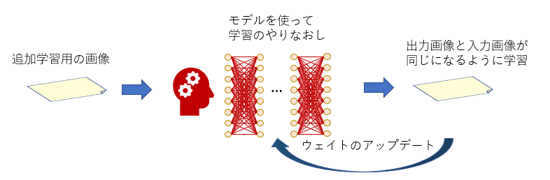

重新训练模型进行追加学习

名为“DreamBooth”的追加学习方法采用了这种方式。

采用这种方法时，如果想要公开追加学习数据，就必须完全分发经过追加学习而更新的新模型。

模型的大小通常在 2 到 5 GB 之间，分发起来相当繁琐。

相比之下，LoRA 学习不涉及对模型的任何更改，而是在希望学习新的“小型[神经网络](https://d.hatena.ne.jp/keyword/%A5%CB%A5%E5%A1%BC%A5%E9%A5%EB%A5%CD%A5%C3%A5%C8)”的位置创建新的网络。追加学习是针对这些小型[神经网络](https://d.hatena.ne.jp/keyword/%A5%CB%A5%E5%A1%BC%A5%E9%A5%EB%A5%CD%A5%C3%A5%C8)进行的。

当要分发 LoRA 时，只需分发这些小型[神经网络](https://d.hatena.ne.jp/keyword/%A5%CB%A5%E5%A1%BC%A5%E9%A5%EB%A5%CD%A5%C3%A5%C8)，因此数据大小较小。

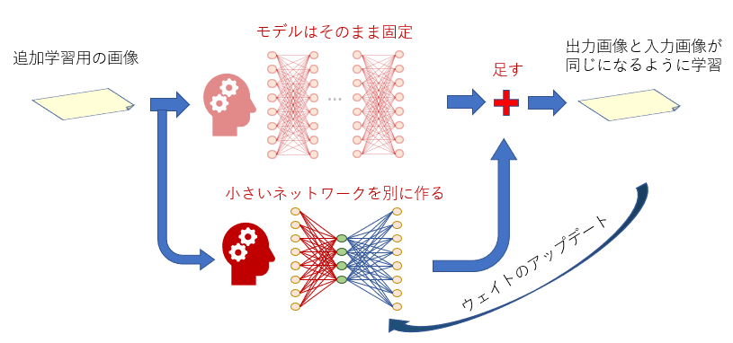

RoLA 学习的目标是小型[神经网络](https://d.hatena.ne.jp/keyword/%A5%CB%A5%E5%A1%BC%A5%E9%A5%EB%A5%CD%A5%C3%A5%C8)。

#### 小型[神经网络](https://d.hatena.ne.jp/keyword/%A5%CB%A5%E5%A1%BC%A5%E9%A5%EB%A5%CD%A5%C3%A5%C8)的结构

LoRA 的小型[神经网络](https://d.hatena.ne.jp/keyword/%A5%CB%A5%E5%A1%BC%A5%E9%A5%EB%A5%CD%A5%C3%A5%C8)由三层组成。左边是“输入层”，右边是“输出层”的[神经元](https://d.hatena.ne.jp/keyword/%A5%CB%A5%E5%A1%BC%A5%ED%A5%F3)数量与目标[神经网络](https://d.hatena.ne.jp/keyword/%A5%CB%A5%E5%A1%BC%A5%E9%A5%EB%A5%CD%A5%C3%A5%C8)的“输入层”和“输出层”的[神经元](https://d.hatena.ne.jp/keyword/%A5%CB%A5%E5%A1%BC%A5%ED%A5%F3)数量相同。中间层的[神经元](https://d.hatena.ne.jp/keyword/%A5%CB%A5%E5%A1%BC%A5%ED%A5%F3)数量称为“秩数”（或维度），这个数量在学习时可以自由确定。

小型[神经网络](https://d.hatena.ne.jp/keyword/%A5%CB%A5%E5%A1%BC%A5%E9%A5%EB%A5%CD%A5%C3%A5%C8%A5%EF%A1%BC%A5%AF)的结构

那么，这个小型[神经网络](https://d.hatena.ne.jp/keyword/%A5%CB%A5%E5%A1%BC%A5%E9%A5%EB%A5%CD%A5%C3%A5%C8)将被添加到哪里呢？

#### LoRA 学习目标 1：U-Net

下图显示了 Stable Diffusion 的核心部分，称为“U-Net”的机制。

U-Net 被分为“Down”（左半部分）、“Mid”（最底部）、“Up”（右半部分）。

它由 Down12 块、Mid1 块、Up12 块总共 25 块组成。

这里的红色箭头部分（橙色块）是 LoRA 学习的目标。换句话说，这些红色箭头的块将被添加一个小型[神经网络](https://d.hatena.ne.jp/keyword/%A5%CB%A5%E5%A1%BC%A5%E9%A5%EB%A5%CD%A5%C3%A5%C8)。

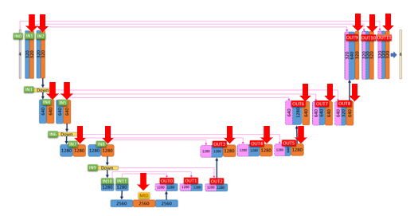

红色箭头的块是 LoRA 学习的目标，称为“Attention 块”。

在橙色块中，进行了“文本处理”，即将作为提示提供的文本反映到图像中的处理。

更详细地看这个块，它执行了以下处理：

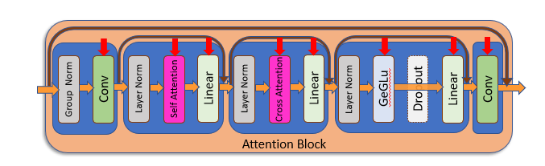

在红色箭头的部分，将分别添加小型[神经网络](https://d.hatena.ne.jp/keyword/%A5%CB%A5%E5%A1%BC%A5%E9%A5%EB%A5%CD%A5%C3%A5%C8)。

虽然这里有很多红色箭头，但对于每个红色箭头的处理，都将添加一个独立的[神经网络](https://d.hatena.ne.jp/keyword/%A5%CB%A5%E5%A1%BC%A5%E9%A5%EB%A5%CD%A5%C3%A5%C8)。

在这里，Kohya_ss 简单地将要添加的[神经网络](https://d.hatena.ne.jp/keyword/%A5%CB%A5%E5%A1%BC%A5%E9%A5%EB%A5%CD%A5%C3%A5%C8)称为“UNet”。

#### RoLA 学习目标 2：文本[编码器](https://d.hatena.ne.jp/keyword/%A5%A8%A5%F3%A5%B3%A1%BC%A5%C0%A1%BC)

LoRA 在这里不仅仅是添加[神经网络](https://d.hatena.ne.jp/keyword/%A5%CB%A5%E5%A1%BC%A5%E9%A5%EB%A5%CD%A5%C3%A5%C8)。

图中上方的“Cross Attention”块从一个称为“文本[编码器](https://d.hatena.ne.jp/keyword/%A5%A8%A5%F3%A5%B3%A1%BC%A5%C0%A1%BC)”的模块接收文本信息。这个“文本[编码器](https://d.hatena.ne.jp/keyword/%A5%A8%A5%F3%A5%B3%A1%BC%A5%C0%A1%BC)”的作用是将提示文本转换为数字序列（向量）。

文本[编码器](https://d.hatena.ne.jp/keyword/%A5%A8%A5%F3%A5%B3%A1%BC%A5%C0%A1%BC)只有一个，它在 U-Net 内的所有 Attention 块中都共同使用。这个文本[编码器](https://d.hatena.ne.jp/keyword/%A5%A8%A5%F3%A5%B3%A1%BC%A5%C0%A1%BC)在 Stable Diffusion 中本来被视为“成品”，不作为模型学习的目标，但在 LoRA 的追加学习中，它也是学习的目标。

由 LoRA 更新的文本[编码器](https://d.hatena.ne.jp/keyword/%A5%A8%A5%F3%A5%B3%A1%BC%A5%C0%A1%BC)将在所有 Attention 块中使用，因此在这里添加的[神经网络](https://d.hatena.ne.jp/keyword/%A5%CB%A5%E5%A1%BC%A5%E9%A5%EB%A5%CD%A5%C3%A5%C8)将对生成的图像产生非常大的影响。

在这里，Kohya_ss 将要添加的[神经网络](https://d.hatena.ne.jp/keyword/%A5%CB%A5%E5%A1%BC%A5%E9%A5%EB%A5%CD%A5%C3%A5%C8)称为“Text Encoder”。

### 尝试启动 kohya_ss

现在我们已经了解了 LoRA 学习的机制，让我们尝试使用 kohya_ss。

在 kohya_ss 文件夹中，双击“gui.bat”文件，会弹出[命令提示符](https://d.hatena.ne.jp/keyword/%A5%B3%A5%DE%A5%F3%A5%C9%A5%D7%A5%ED%A5%F3%A5%D7%A5%C8)（黑色背景的文本窗口）。过一段时间，窗口中将显示一个 URL，将其输入到Web浏览器的URL栏中并按回车键，kohya_ss 的界面将在浏览器上显示。

启动 kohya_ss 后，界面的顶部会出现几个选项卡。选择其中的“Dreambooth LoRA”。这是用于 LoRA 学习的选项卡。

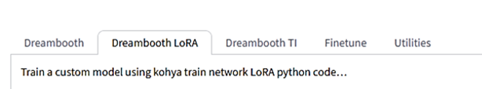

从左数第二个选项卡是 LoRA 学习设置

### LoRA 学习的各项设置

选择“Dreambooth LoRA”选项卡后，将会看到许多设置选项。在这里解释一下这些设置。

#### LoRA 设置的保存与加载

最顶部的是“配置文件”。在这里，您可以将 LoRA 设置保存为配置文件，并加载配置文件。

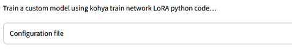

设置可以保存为配置文件，并在需要时加载配置文件以还原设置，因此建议将喜欢的设置保存起来。

接下来，有四个选项卡。我们将分别详细查看前三个。

（由于「Tools」选项卡在 LoRA 学习时不使用，因此省略其说明。）

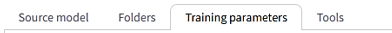

模型选择、学习图像文件夹、详细设置、工具各选项卡

#### Source model 选项卡：用于学习的基础模型设置

##### Pretrained model name or path

在这里指定基础模型的位置。正如之前所解释的，LoRA 在现有模型上添加小型[神经网络](https://d.hatena.ne.jp/keyword/%A5%CB%A5%E5%A1%BC%A5%E9%A5%EB%A5%CD%A5%C3%A5%C8)。换句话说，LoRA 学习是创建“基础模型+α”中的“+α”部分的过程。

由于 LoRA 学习受基础模型特征的影响很大，

*   需要选择与训练图像兼容的基础模型
*   需要选择在图像生成时使用（或预期使用）的与模型兼容的基础模型

例如，如果训练图像是类似实际照片的图像，则最好选择擅长生成实际照片的模型。如果训练图像是2D风格的图像，但预期生成的图像是实际照片风格的话，可能应该选择一个混合了2D风格和3D风格的模型。

值得注意的是，生成的 LoRA 文件仅包含“添加的[神经网络](https://d.hatena.ne.jp/keyword/%A5%CB%A5%E5%A1%BC%A5%E9%A5%EB%A5%CD%A5%C3%A5%C8)”的数据，不包含基础模型的数据。因此，使用生成的 LoRA 文件生成图像时，不仅可以使用在这里指定的基础模型，还可以与任何其他模型一起使用。

##### Model Quick Pick

在这里选择模型后，在执行学习时，该模型将自动通过网络下载并用作基础模型。对于 Pretrained model name or path 的指定将被忽略。

如果模型未保存在个人计算机上，或者不确定使用哪个模型，可以在这里选择可用的模型。

通常会选择使用 "runwayml/stable-diffusion-v1-5" 模型。

如果想使用自己准备的模型，请选择 custom。

##### Save trained model as

可以指定以哪种文件格式保存经过训练的 LoRA 文件。

ckpt 曾经是 Stable Diffusion 中广泛使用的格式，但由于这种格式存在安全问题，因此出现了更安全的文件格式 safetensors。目前 safetensors 已经成为主流。

除非有特殊原因，否则应选择 safetensors。

##### v2

Stable Diffusion 模型分为 "Version 1 系" 和 "Version 2 系" 两个版本，它们的数据结构各不相同。截至 2023 年 5 月，"Version 2 系" 尚未广泛普及，大多数知名模型仍属于 "Version 1 系"。

然而，如果要使用 "Version 2 系" 的模型作为基础模型，请将此选项打开。

默认情况下是关闭的。

##### v_parameterization

v-parameterization 是在 "Version 2 系" 模型中引入的一种技术，它是为了在比传统方法更少的采样步骤下稳定地生成图像而设计的技巧。

当使用 "Version 1 系" 模型时，可以不使用此选项，但如果已知您的基础模型引入了 v-parameterization，请将此选项打开。在启用此选项时，一定要同时打开 v2。

默认情况下是关闭的。

#### Folders 选项卡：设置学习图像的位置和 LoRA 输出位置

##### Image folder

指定包含学习图像的文件夹的位置（例如，名为 "10_cat" 的文件夹）。

请注意，这里指定的是包含图像的文件夹的位置，而不是图像本身所在的位置。

##### Output folder

指定 LoRA 文件完成后的输出位置。如果要输出学习过程中的 LoRA（稍后会详述），也会输出到此处指定的位置。

##### Regularisation folder

在 LoRA 学习中，学习图像的特征经常会过于强烈地与意外的单词关联，导致每次放入这个单词时只生成类似学习图像的图像，这种情况经常发生。

因此，通过同时学习“[正则化](https://d.hatena.ne.jp/keyword/%C0%B5%C2%A7%B2%BD)图像”（即“不像学习图像”的图像），可以防止学习目标与特定单词过于强烈地关联。[正则化](https://d.hatena.ne.jp/keyword/%C0%B5%C2%A7%B2%BD)图像的使用不是必需的，但如果要在学习中使用[正则化](https://d.hatena.ne.jp/keyword/%C0%B5%C2%A7%B2%BD)图像，则在这里指定包含[正则化](https://d.hatena.ne.jp/keyword/%C0%B5%C2%A7%B2%BD)图像的文件夹的位置。

##### Logging folder

如果想要将训练期间的处理输出和保存为日志，可以在这里指定保存的位置。

指定的文件夹名称将在工作文件夹中创建，其中将包含一个以训练日期时间命名的文件夹。日志将保存在该文件夹中。

值得注意的是，日志文件可以使用名为 "tensorboard" 的工具或在线服务 "WandB"（稍后详述）进行图形化处理。

##### Model output name

在这里指定生成的 LoRA 文件的名称。不需要添加扩展名。

使用带版本号的名称，例如 "〇〇_ver1.0"（〇〇是学习目标的名称），可以更加清晰明了。

请注意，尽量避免在名称中使用日语。

生成的 LoRA 文件可以作为“元数据”来嵌入文本。如果有要嵌入的文本，请在这里记录。

值得注意的是，“元数据”可以在 Stable Diffusion WebUI 的 LoRA 选择屏幕上点击ⓘ图标后查看。

#### Training parameters 选项卡：学习的详细设置

在这个选项卡中，您将设置几乎所有用于LoRA学习的参数。

##### LoRA type

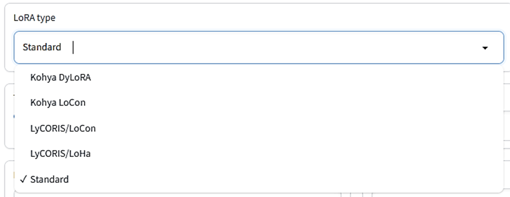

这里指定了LoRA学习的类型。前面解释的LoRA是“标准”类型。“DyLoRA”会同时学习指定rank以下的多个rank，因此在想要选择最佳rank时很方便。LoHa是高效的LoRA，LoCon将学习扩展到U-Net的Res块。

一开始可以使用标准类型，如果学习不顺利，可以尝试其他类型。

##### LoRA network weights

当您想要使用已经训练好的LoRA文件进行进一步的追加学习时，您可以在这里指定LoRA文件。

在学习开始时，指定的LoRA将被加载，并从这个LoRA的状态开始学习。学习后的LoRA将以另一个文件的形式保存，因此在这里指定的LoRA文件不会被覆盖。

##### DIM from weights

这是一个特定于使用LoRA网络权重进行追加训练时的选项。

正如上图所示，LoRA添加了一个小的神经网络，其中间层的神经元数（秩数）可以在Network Rank（稍后解释）中自由设置。

然而，当打开此选项时，将设置要创建的LoRA的秩数，使其与在LoRA network weights中指定的LoRA的秩数相同。在此选项打开时，将忽略Network Rank的指定。

例如，如果要用于追加训练的LoRA的秩数为32，则要创建的LoRA的秩数也将被设置为32。

默认情况下，此选项为关闭状态。

##### Train batch size

指定要使用的批处理大小。批处理是“一次读取的图像数量”的意思。如果批处理大小为2，则一次学习2张图像。虽然一次学习多个不同的图像会降低对每个图像的调整精度，但由于学习综合地捕捉多个图像的特征，最终的效果可能会更好。

（如果对特定的图像进行过多调整，LoRA可能会变得无法应用。）

一次学习多个图像，因此批处理大小越大，学习时间越短，但是调整精度会降低，并且权重更改的次数也会减少，因此在某些情况下可能会导致学习不足。

（有报告称，当增加批处理大小时，最好也增加学习速率（Learning rate，稍后解释）。例如，如果批处理大小为2，则将学习速率增加到2倍。）

此外，增加批处理大小会消耗更多内存。应根据您的PC的VRAM大小来决定。

如果VRAM为6GB，则批处理大小2可能勉强可行。

默认值为1。

※每批次同时读取的图像必须具有相同的大小，因此如果学习图像的大小不同，可能会同时处理比在此处指定的批次数更少的图像。

##### Epoch

1个时期是指“1次完整的训练”。

例如，假设要对50张图像进行训练，每张图像读取10次。在这种情况下，1个时期就是50x10＝500次训练。如果是2个时期，就会重复2次，因此为500x2＝1000次训练。

在指定的时期数学习结束后，LoRA文件将被创建并保存在指定的位置。

对于LoRA来说，进行2到3个时期的学习通常就足够产生良好的效果。

##### Save every N epochs

您可以根据在此处指定的时期数定期保存中间结果作为LoRA文件。

例如，如果将“Epoch”设置为10，并将“Save every N epochs”设置为2，则每2个时期（在第2、4、6、8个时期结束时）将LoRA文件保存到指定的文件夹中。

如果不需要创建中间结果的LoRA文件，则将此处的数值设置为与“Epoch”相同的数值。

##### Caption Extension

如果您为每个图像准备了标题文件，则在此处指定该标题文件的扩展名。

如果这里为空，则扩展名将为“.caption”。如果标题文件的扩展名为“.txt”，则在这里指定“.txt”。

如果没有标题文件，可以忽略这一项。

##### Mixed precision

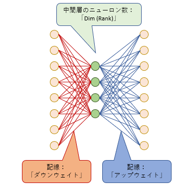

指定学习时权重数据混合精度的类型。

通常，权重数据是32位的（在没有选择的情况下）。但根据需要，混合16位的数据进行训练可以大大节省内存并提高速度。fp16是将精度减半的[数据格式](https://d.hatena.ne.jp/keyword/%A5%C7%A1%BC%A5%BF%B7%C1%BC%B0)，bf16是一种[数据格式](https://d.hatena.ne.jp/keyword/%A5%C7%A1%BC%A5%BF%B7%C1%BC%B0)，可以处理与32位数据相同范围的数值。

使用fp16可以获得足够高精度的LoRA。

##### Save precision

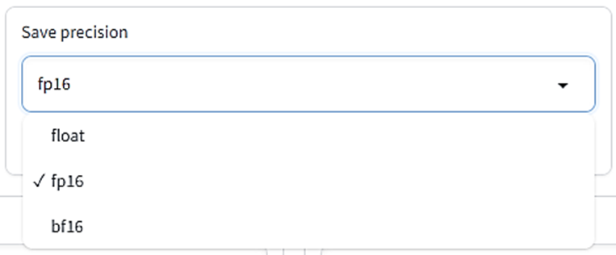

指定要保存在LoRA文件中的权重数据类型。

float是32位，而fp16和bf16是16位。下面的两者的文件大小要小得多。

默认为fp16。

##### Number of CPU threads per core

这是每个 CPU 核心的线程数。一般来说，数值越大效率越高，但需要根据硬件规格进行调整。

默认值是 2。

##### Seed

Seed 是决定随机处理步骤的标识，比如决定图像加载顺序、给学习图像添加多少噪声（详细内容省略）等随机处理。

指定相同的 Seed 将使用相同的随机处理步骤，从而更容易重现学习结果。但是，由于还存在不使用此 Seed 的随机处理（例如，随机裁剪图像等），因此即使指定相同的 Seed，也不能保证一定获得相同的学习结果。

默认值为空。如果不指定，将在执行学习时自动设置 Seed。

如果希望尽可能地重现结果，可以随意指定一个数字（例如1234）。

##### Cache latents

学习图像被加载到 VRAM 中，在进入 U-Net 之前，它们会被“压缩”成 Latent 状态并在 VRAM 中进行学习。通常，每次加载图像时都会进行“压缩”，但是如果选中 Cache latents，可以指定在主内存中保留“压缩”后的图像。

在主内存中保留可以节省 VRAM 空间并提高速度，但是由于无法进行“压缩”前的图像处理，因此除了 flip_aug 之外的其他增强技术（后文有介绍）将无法使用。此外，每次在随机范围内裁剪图像的 random crop（后文有介绍）也将无法使用。

默认情况下，此选项已启用。

##### Cache latents to disk

这个选项类似于 Cache latents，但是在这里，如果选中此复选框，可以指定将压缩图像数据保存为磁盘上的临时文件。

由于在重新启动 kohya_ss 后仍然可以重复使用这个临时文件，因此如果想要在相同的数据上进行多次 LoRA 学习，启用此选项可以提高学习效率。

但是，启用此选项会导致除了 flip_aug 之外的增强技术和 random crop 无法使用。

默认情况下，此选项已禁用。

##### Learning rate:

学习率用于指定“学习”过程中，通过调整神经网络内部连接的权重，使生成的图像更加贴近给定图像。如果每次都大幅度地调整权重，那么网络可能会过于专注于调整以匹配给定图像，导致无法生成其他类型的图像。

为了避免这种情况，学习率确定了每次只略微调整权重的量。学习率（Learning rate）即决定了这个“略微调整”的程度。

默认值为 0.0001。

##### LR Scheduler:

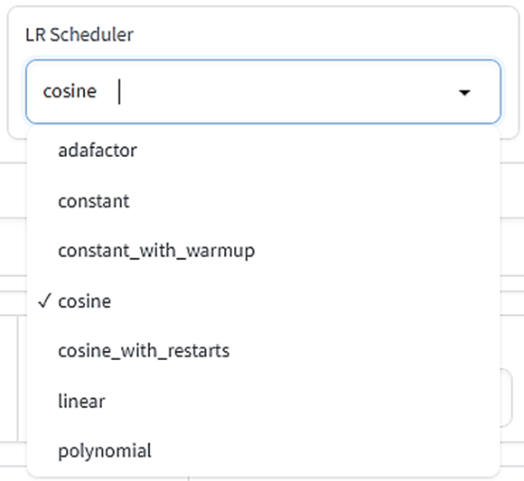

学习过程中可以调整学习率（Learning rate）。这里的“Scheduler”指的是“如何设置学习率变化”的配置。

- **adafactor：** 如果将Optimizer（后续介绍）设置为Adafactor，则选择此选项。它会在学习的同时自动调整学习率，以便根据情况进行VRAM（显存）的节省。
- **constant：** 学习率在整个训练过程中保持不变。
- **constant_with_warmup：** 学习率从0开始，通过热身阶段逐渐增加到设定的Learning rate值，在正式学习时使用Learning rate设定值。
- **cosine：** 在学习率沿着波形（余弦曲线）逐渐减小的同时画波形。
- **cosine_with_restarts：** 多次重复[cosine](https://d.hatena.ne.jp/keyword/cosine)（请查看LR number of cycles的解释）。
- **linear：** 一开始使用Learning rate设定值，然后线性降低到0。
- **polynomial：** 行为与linear相同，但下降方式稍微复杂（请查看LR power的解释）。

如果希望将学习率固定为Learning rate设定值，请选择constant。

默认选择是[cosine](https://d.hatena.ne.jp/keyword/cosine)。

##### LR warmup

如果在Scheduler中选择了constant_with_warmup，那么在这里设置进行多少次Warm-up。在这里指定的数字是总步数的百分比。

例如，使用批量大小为1学习10次的50张图像，将其执行2个epoch，总步数为50x10x2=1000。如果将LR warmup设置为10，那么总步数1000中的前10%，即100步，将用于Warm-up。

如果Scheduler不是constant_with_warmup，则可以忽略此设置。

默认值为10。

##### Optimizer

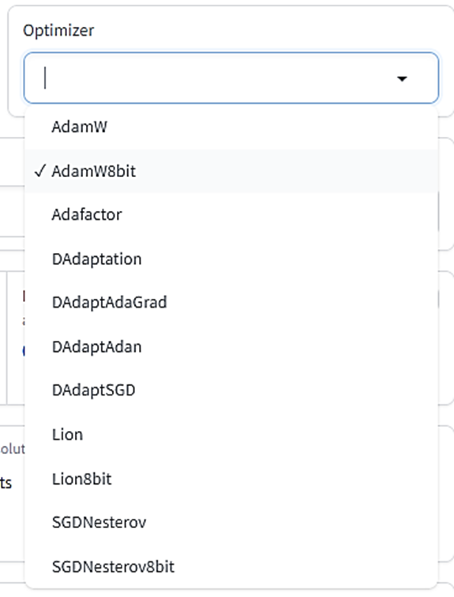

[Optimizer](https://d.hatena.ne.jp/keyword/%A5%AA%A5%D7%A5%C6%A5%A3%A5%DE)ー是指“在学习过程中如何更新[神经网络](https://d.hatena.ne.jp/keyword/%A5%CB%A5%E5%A1%BC%A5%E9%A5%EB%A5%CD%A5%C3%A5%C8)权重”的设置。虽然有许多为了智能学习而提出的方法，但在 LoRA 学习中最常用的是“AdamW”（32 位）或“AdamW8bit”。AdamW8bit 的 VRAM 使用量较低，精度也足够，所以如果犹豫不决，可以选择使用它。

此外，还有一种常见的方法是在引入 Adam 方法的同时，根据学习进度适当调整学习率，这就是“Adafactor”（使用 Adafactor 时将忽略学习率设置）。

“DAdapt”用于调整学习率的[优化器](https://d.hatena.ne.jp/keyword/%A5%AA%A5%D7%A5%C6%A5%A3%A5%DE)器，“Lion”是相对较新的[优化器](https://d.hatena.ne.jp/keyword/%A5%AA%A5%D7%A5%C6%A5%A3%A5%DE)器，但尚未经过充分验证。“SGDNesterov”有报道称学习精度很好，但速度较慢。

默认为 AdamW8bit，基本上保持不变即可。如果想对指定的[优化器](https://d.hatena.ne.jp/keyword/%A5%AA%A5%D7%A5%C6%A5%A3%A5%DE)器进行更详细的设置，可以在此处填写相关命令。

通常情况下，保持为空白即可。

##### Text Encoder learning rate

这个设置用于指定文本编码器的学习率。正如前面所述，文本编码器的附加学习将影响整个 U-Net。

因此，通常将其设置为低于 U-Net 各块的学习率（Unet learning rate）。

默认值为 0.00005（5e-5）。

如果在这里指定了数值，那么这个值将优先于学习率的设置。

##### Unet learning rate

这个设置用于指定 U-Net 的学习率。当对 U-Net 中的每个 Attention Block（根据设置，可能还包括其他块）进行附加训练时使用的学习率。

默认值为 0.0001。

如果在这里指定了数值，那么这个值将优先于学习率的设置。

##### Network Rank(Dimension)

这里用于指定在文章上方描述的“添加的小型神经网络”中间层的神经元数（详细请参见上图）。

神经元数越多，可以保持的学习信息就越多。但是，神经元数过多可能会导致学习不相关的冗余信息，LoRA 文件的大小也会增加。

通常情况下，设置为最大 128 是常见的，但也有报告称，32 已经足够。如果是试验性地创建 LoRA，可能最好从 2 到 8 开始。

默认值是 8。

##### Network alpha:

这是为了在保存 LoRA 时防止权重被舍入为零而引入的一种方便的处理。

由于 LoRA 的结构，神经网络的权重值往往会变得很小，如果太小，就无法区分为零（即与未学习相同）。因此，提出了一种技巧，即在实际的（保存的）权重值保持较大的同时，在学习时始终以一定比例减弱权重，以使权重值看起来较小。这个“减弱权重的比例”由 Network alpha 决定。

**Network alpha 值越小，保存的 LoRA 的神经网络权重值就越大。**

在使用时，权重减弱的程度（使用强度）由 "Network_Alpha/Network_Rank" 计算（几乎为 0 到 1 的值），与 Network Rank 数密切相关。

如果学习后的 LoRA 精度不佳，可能是因为权重数据太小而被压缩为 0。这时，尝试降低 Network Alpha 值（即增大保存权重值）可能会有帮助。

默认值为 1（即尽量将保存的权重值设置为最大值）。

如果 Network Alpha 和 Network Rank 的值相同，则效果将被关闭。

※请注意，Network Alpha 的值不应超过 Network Rank 的值。虽然可以指定超过的数字，但这很可能会导致意外的 LoRA 结果。

此外，在设置 Network Alpha 时，需要考虑其对学习率的影响。

例如，如果 Alpha 为 16，Rank 为 32，则权重的使用强度为 16/32 = 0.5，也就是说，学习率只有 "Learning Rate" 设置值的一半效力。

如果 Alpha 和 Rank 的数字相同，则使用强度为 1，对学习率没有任何影响。

##### Max resolution

这里需要以“宽度、高度”的顺序指定学习图像的最大分辨率。如果学习图像的分辨率超过此处指定的值，它将被缩小至此分辨率。

默认值为“512, 512”。由于许多模型都使用这个大小的图像，因此在进行LoRA学习时，使用这个大小的图像是比较稳妥的。

##### Stop text encoder training

文本编码器的训练可以在中途停止。正如前面所述，文本编码器的更新对整体产生重大影响，因此容易陷入[过拟合](https://d.hatena.ne.jp/keyword/%B2%E1%B3%D8%BD%AC)（对学习图像进行过度调整，使得无法绘制其他图像）。在适当的时候停止训练也是防止[过拟合](https://d.hatena.ne.jp/keyword/%B2%E1%B3%D8%BD%AC)的一种方法。

在这里指定的数字是总学习步骤的百分比。一旦学习达到这个百分比，文本编码器将停止学习。

例如，如果总步骤数为1000，这里指定为80，那么当学习进度达到80%时，即在1000x0.8=800步时，文本编码器的学习将结束。

U-Net的训练将继续进行，剩余步骤为200。

如果这里的值为0，文本编码器的训练将不会停止，将一直进行到最后。

##### Enable buckets

「[bucket](https://d.hatena.ne.jp/keyword/bucket)」字面上就是指“桶”的意思。在LoRA中，用于训练的图像可以是不同大小的，但不能同时训练不同大小的图像。因此，在进行训练之前，需要根据图像的大小将其分配到相应的“桶”中。相似大小的图像将放置在同一个“桶”中，而不同大小的图像将放置在不同的“桶”中。

默认情况下，此选项是启用的。

如果所有训练图像的大小都相同，可以将此选项关闭，但即使保持启用状态也不会产生影响。

※ 如果训练图像的大小不一致，并将“启用桶”设置为关闭，则训练图像将被调整大小，以使它们的大小相等。

调整大小时会保持图像的[纵横比](https://d.hatena.ne.jp/keyword/%A5%A2%A5%B9%A5%DA%A5%AF%A5%C8%C8%E6)。如果[纵横比](https://d.hatena.ne.jp/keyword/%A5%A2%A5%B9%A5%DA%A5%AF%A5%C8%C8%E6)与基准大小不同，调整大小后的图像的垂直或水平部分可能会超出基准大小。例如，如果基准大小为512x512（[纵横比](https://d.hatena.ne.jp/keyword/%A5%A2%A5%B9%A5%DA%A5%AF%A5%C8%C8%E6) 1），而图像大小为1536x1024（[纵横比](https://d.hatena.ne.jp/keyword/%A5%A2%A5%B9%A5%DA%A5%AF%A5%C8%C8%E6) 1.5），则图像将被缩小为768x512（[纵横比](https://d.hatena.ne.jp/keyword/%A5%A2%A5%B9%A5%DA%A5%AF%A5%C8%C8%E6) 1.5）。

#### Advanced Configuration

高级配置”部分的选项。

##### Weights、Blocks、Conv

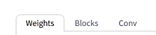

这些是 U-Net 内每个块的“学习权重”和“等级”设置。选择每个标签时，相应的设置界面将显示出来。

※这些设置是为高级用户准备的。如果没有特别要求，可以将它们全部留空。

##### Weights: Down LR weights/Mid LR weights/Up LR weights

根据 U-Net 的结构图，U-Net 由 12 个 IN 块、1 个 MID 块和 12 个 OUT 块组成，总共有 25 个块。

如果要更改每个块的学习率权重（权重），则可以在这里进行单独设置。

在这里，所谓的权重是指表示为 0 到 1 的数字，表示“学习强度”。当值为 0 时，“不学习”，当值为 1 时，“以学习率设置的学习率进行学习”，可以通过改变学习的强度来调整学习的强度。

如果将权重设为 0.5，则学习率将为 Learning rate 的一半。

“Down LR weights”指定了 12 个 IN 块的每个权重。

“Mid LR weights”指定了 MID 块的权重。

“Up LR weights”指定了 12 个 OUT 块的每个权重。

##### Weights: Blocks LR zero threshold

我已经解释了“LoRA 添加了神经网络”（LoRA 添加了一个神经网络），但是对于权重过小（即几乎没有学习）的[神经网络](https://d.hatena.ne.jp/keyword/%A5%CB%A5%E5%A1%BC%A5%E9%A5%EB%A5%CD%A5%C3%A5%C8)，即使添加了[神经网络](https://d.hatena.ne.jp/keyword/%A5%CB%A5%E5%A1%BC%A5%E9%A5%EB%A5%CD%A5%C3%A5%C8)也没有意义。因此，可以设置“不要在权重过小的块中添加[神经网络](https://d.hatena.ne.jp/keyword/%A5%CB%A5%E5%A1%BC%A5%E9%A5%EB%A5%CD%A5%C3%A5%C8)”这一选项。

在这里，您可以设置的权重值以下的块将不添加[神经网络](https://d.hatena.ne.jp/keyword/%A5%CB%A5%E5%A1%BC%A5%E9%A5%EB%A5%CD%A5%C3%A5%C8)。例如，如果在此处指定为 0.1，则权重设置为 0.1 或更低的块将不添加[神经网络](https://d.hatena.ne.jp/keyword/%A5%CB%A5%E5%A1%BC%A5%E9%A5%EB%A5%CD%A5%C3%A5%C8)（请注意，排除目标包括指定值！）。

默认为空白，如果为空白，则默认为 0（什么都不做）。

##### Blocks: Block dims, Block alphas

在这里，您可以为 IN0～11、MID、OUT0～11 的 25 个不同块分别设置不同的 Rank（dim）值和 Alpha 值。

有关 Rank 值和 Alpha 值的详细信息，请参阅 Network Rank、Network Alpha 的说明。

较大 Rank 值的块可以保留更多信息。

这些参数值必须始终指定 25 个数字，但由于 LoRA 将 Attention 块作为学习目标，因此对于不存在 Attention 块的 IN0、IN3、IN6、IN9、IN10、IN11、OUT0、IN1、IN2 的设置（1、4、7、11、12、14、15、16 号数字）在学习时将被忽略。

※这是一个高级用户设置。如果您不关心这些，请保持为空。如果不指定这里，将对所有块应用“Network Rank(Dimention)”值和“Network Alpha”值。

##### Conv: Conv dims, Conv, alphas

LoRA 学习的注意块中有一个名为 "Conv" 的卷积[神经网络](https://d.hatena.ne.jp/keyword/%A5%CB%A5%E5%A1%BC%A5%E9%A5%EB%A5%CD%A5%C3%A5%C8)，通过追加学习也将其更新（请查看文章顶部的 Attention 层结构图）。这是一种称为 "卷积" 的处理，使用的 "过滤器" 大小为 1x1 像素。

有关卷积的详细信息，请阅读[这篇文章](https://github.com/kohya-ss/sd-scripts/pull/121)。

另一方面，除了 Attention 块（Res 块、Down 块）和 OUT 中的部分 Attention 块之外，还有一些使用 [3x3](https://d.hatena.ne.jp/keyword/3x3) 像素的过滤器进行卷积的部分。本来这些部分不是 LoRA 的学习目标，但通过这个参数，您可以将 Res 块的 [3x3](https://d.hatena.ne.jp/keyword/3x3) 卷积也作为学习目标。

由于学习目标的增加，可能进行更精确的 LoRA 学习。

设置方法与 "Blocks: Blocks dims, Blocks alphas" 相同。

[3x3](https://d.hatena.ne.jp/keyword/3x3) 的 Conv 存在于全部 25 层。

※这是一个高级用户设置。如果您不关心这些，请保持为空。

##### No token padding

学习图像的标题将每 75 个[令牌](https://d.hatena.ne.jp/keyword/%A5%C8%A1%BC%A5%AF) 进行一次处理（"令牌" 基本上可视为 "单词"，没有问题）。

如果标题的长度少于 75 个[令牌](https://d.hatena.ne.jp/keyword/%A5%C8%A1%BC%A5%AF)，则会在标题的末尾添加足够数量的终止符，使其达到 75 个[令牌](https://d.hatena.ne.jp/keyword/%A5%C8%A1%BC%A5%AF)。这称为 "填充"。

在这里，您可以指定不进行[令牌](https://d.hatena.ne.jp/keyword/%A5%C8%A1%BC%A5%AF)填充。

默认情况下为关闭。基本上可以保持关闭状态。

##### Gradient accumulation steps

通常情况下，权重更新（即“学习”）是在每读取一个批次后进行的，但也可以选择将多个批次的学习合并在一起进行。这个选项指定了一次合并多少个批次进行学习。

这与增加批次大小有类似的效果（并不是“相同的效果”！）。

例如，如果批次大小为 4，那么一次同时读取的图像数量为 4 张。换句话说，每读取 4 张图像进行 1 次学习。在这里，将 Gradient accumulation steps 设置为 2，则每 2 个批次进行 1 次学习，因此，实际上每读取 8 张图像进行 1 次学习。这与批次大小为 8 有类似的效果（但并不相同！）。

增加这个数字会减少学习次数，因此处理速度会更快，但会消耗更多内存。

默认值为 1。

##### Weighted captions

将这个选项打开后，您可以在学习图像的标题中使用 Stable Diffusion WebUI 的提示符描述法。例如，如果您希望在提示符中指定“[black cat](https://d.hatena.ne.jp/keyword/black cat)”时强调“Black”，您可以使用“(black:1.2) cat”这样的方式，用括号括起来，然后在单词后面加上“: 数字”，这个数字表示该单词的强调倍数。

这使您能够创建更复杂的标题。默认情况下，此选项处于关闭状态。

##### Prior loss weight

Prior loss weight 用于确定在训练时有多重要考虑“[正则化](https://d.hatena.ne.jp/keyword/%C0%B5%C2%A7%B2%BD)图像”（详细信息请参阅上面的 Regularisation folder 的说明）。

如果这个值较低，那么会认为[正则化](https://d.hatena.ne.jp/keyword/%C0%B5%C2%A7%B2%BD)图像不太重要，生成的 LoRA 将更强烈地表现出训练图像的特征。

如果不使用[正则化](https://d.hatena.ne.jp/keyword/%C0%B5%C2%A7%B2%BD)图像，则此设置将无意义。

这是一个介于 0 到 1 之间的值，默认值为 1（重视[正则化](https://d.hatena.ne.jp/keyword/%C0%B5%C2%A7%B2%BD)图像）。

##### LR number of cycles

如果在调度程序中选择了 "Cosine with restart" 或 "Polynomial"，则此选项用于指定学习中执行调度程序的周期数。

如果此选项的数值大于等于 2，则在一次训练中将执行多次调度程序。

"Cosine with restart" 和 "Polynomial" 都是随着训练的进行，学习率逐渐下降到 0，但如果周期数大于 2，则当学习率达到 0 时，它将被重置并重新启动。

下图（[引用来源](https://github.com/kohya-ss/sd-scripts/pull/121)）是 "Cosine with restart"（紫色）和 "Polynomial"（淡绿色）学习率变化的示例。

在紫色的示例中，周期数设置为 4。在淡绿色的示例中，周期数为 1。

由于在指定的学习步骤内执行指定的周期数，因此周期数越多，学习率的变化就越剧烈。

默认为空，如果为空，则默认为 1。

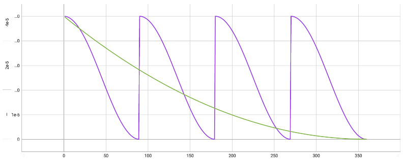

示例：

在 "Cosine with restart" 中，学习率的变化如下所示，其中 "LR number of cycle" 设置为 4（紫色）；在 "Polynomial" 中，学习率的变化如下所示，其中 "LR power" 设置为 2（淡绿色）。

##### LR power

这是设置使用 "Polynomial" 调度器时的选项，该数字越大，初始学习率的下降趋势就会变得越陡峭（如上图中淡绿色线的斜率变得很陡峭）。

当 power 为 1 时，它与线性调度器的形状相同。

请注意不要将数值设置得太大，否则学习率可能会接近 0，导致学习不足。默认情况下为空，为空时将设置为 1（即与线性调度器相同）。

##### Additional parameters

如果您想调整 kohya_ss 的 GUI 中未显示的学习设置参数，可以在这里作为命令输入。

通常情况下，您可以将其保留为空。

##### Save every N steps

指定的学习步数结束时，将创建并保存 LoRA 文件。

例如，如果总学习步数为1000，而您在这里指定为200，则在步骤结束时200、400、600、800将保存 LoRA 文件。

有关中间保存 LoRA 的进展，请参阅“每 N 个周期保存一次”的内容。

默认值为0（不保存中间 LoRA）。

##### Save last N steps

这是关于在学习过程中保存 LoRA（可能指的是某种模型或文件）的选项，通过“Save every N steps”指定保存的频率。

如果希望仅保留最近的 LoRA 文件并且删除旧的 LoRA 文件，您可以在这里设置“保留最近多少步的 LoRA 文件”。例如，假设总学习步骤为 600，通过“Save every N steps”选项设置为每100步保存一次。这样，在第100、200、300、400和500步时，将保存 LoRA 文件。但是，如果将“Save every N steps”设置为300，那么只会保留最近的300步 LoRA 文件。换句话说，在第500步时，将删除早于第200步（即第500步-300步）的 LoRA 文件，即第100步的 LoRA 文件。

默认值为0。

##### Keep n tokens

如果学习图像带有标题，并且可以通过“Shuffle caption”选项随机交换标题中由逗号分隔的单词（有关详细信息，请参阅Shuffle caption选项），但如果有一些希望始终放在最前面的单词，您可以使用这个选项指定“最初的〇个词固定在开头。”。

指定的数量的最前面的单词将始终被固定在标题的最前面。

默认值为0。如果“Shuffle caption”选项已关闭，则此选项将不起作用。

请注意，这里所说的“单词”是指由逗号分隔的文本。无论分隔的文本包含多少个单词，它都会被计为“1 个单词”。

例如，在“[black cat](https://d.hatena.ne.jp/keyword/black%20cat)，eating，sitting”中，“[black cat](https://d.hatena.ne.jp/keyword/black%20cat)”被计为1 个单词。

##### Clip skip

这段文本描述了一个名为 "CLIP" 的文本编码器，由 12 个类似的层构成。原始文本经过这 12 层的处理，被转换成数字序列（向量），然后从最后一层输出的向量被送入 U-Net 的 Attention 模块。

然而，一项名为 "Novel AI" 的服务开发了一种独特的模型，通常被称为 "Novel AI 模型"，采用了一种特殊的规格，即使用不是最后一层而是倒数第二层输出的向量。派生自 Novel AI 模型的其他模型也采用了类似的方式。因此，需要指定使用 CLIP 中的哪一层输出向量作为“学习基础模型”的输入。

这里的 "Clip skip" 参数用于指定 "最后从第〇层"，如果设置为 2，那么将使用倒数第二层的输出向量传递到 Attention 模块。如果设置为 1，将使用最后一层的输出向量。

如果基础模型采用 Novel AI 模型（或其混合模型），建议将 "Clip skip" 设置为 2。对于其他情况，可以设置为 1。

##### Max Token Length

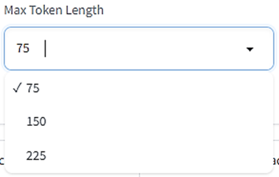

这段文本描述了指定标题中包含的最大 [对话](https://d.hatena.ne.jp/keyword/%A5%C8%A1%BC%A5%AF) 数。在这里，“[对话](https://d.hatena.ne.jp/keyword/%A5%C8%A1%BC%A5%AF)”不是指单词数量，而是与单词数量大致相同到1.5倍左右的数量。请注意，逗号也会计入 [对话](https://d.hatena.ne.jp/keyword/%A5%C8%A1%BC%A5%AF) 数。

虽然很少会使用超过 75 [对话](https://d.hatena.ne.jp/keyword/%A5%C8%A1%BC%A5%AF) 的标题，但当您觉得“标题文本太长”时，可以在这里指定更大的数字。

##### Full fp16 training (experimental)

这段文本描述了一个名为 "Mixed precision" 的选项，当启用（设置为 fp16 或 bf16）时，在训练过程中将同时使用 32 位和 16 位的数据，但将所有权重数据对齐为 16 位（fp16 格式）。这可以节省内存，但由于部分数据精度减半，可能导致训练精度下降。

默认情况下是关闭的。除非您确实需要节省内存，否则最好保持关闭状态。

##### Gradient checkpointing

通常情况下，在训练过程中，每次加载图像时都会同时修正和更新大量[神经网络](https://d.hatena.ne.jp/keyword/%A5%CB%A5%E5%A1%BC%A5%E9%A5%EB%A5%CD%A5%C3%A5%C8)的权重。通过将这个过程从“一斉”将修正改为逐渐”修正，可以减少计算处理并节省内存。

该选项指定了逐渐进行权重计算。启用或禁用此选项对 LoRA 的训练结果没有影响。

默认情况下是关闭的。

##### Shuffle caption

这段文本描述了一个名为 "Shuffle caption" 的选项。当图像的学习数据带有标题时，许多标题通常以逗号分隔的单词形式写成，例如"[black cat](https://d.hatena.ne.jp/keyword/black%20cat), eating, sitting"。Shuffle caption 选项允许每次随机交换逗号分隔的单词的顺序。

通常情况下，标题中的单词越靠近开头，其重要性越大。因此，如果单词的顺序是固定的，可能导致学习不良，后面的单词可能无法良好学习，前面的单词可能与学习图像产生意外的关联。通过每次加载图像时随机交换单词的顺序，可以修正这种偏向。

值得注意的是，如果标题不是以逗号分隔而是连续的句子，那么这个选项就没有意义。

默认情况下是关闭的。

※这里所说的“単語”是指逗号分隔的文本。无论分隔的文本包含多少个单词，它都会被计为“1 个单词”。

例如，在“[black cat](https://d.hatena.ne.jp/keyword/black%20cat)，eating，sitting”中，“[black cat](https://d.hatena.ne.jp/keyword/black%20cat)”被计为1 个单词。

##### Persistent data loader

这段文本描述了一个名为 "用于学习的数据" 的选项。该选项控制在每个周期结束时是否丢弃并重新加载学习所需的数据。当启用这个选项时，不会丢弃数据，而是保持它们以供新周期的学习使用。这样可以提高开始新周期学习的速度，但会占用额外的内存。

默认情况下是关闭的。

##### Memory efficient attention

选中此选项将限制VRAM的使用并进行Attention模块的处理。相较于下一个选项“xformers”，速度会变慢。当VRAM容量有限时，建议启用此选项。

默认情况下是关闭的。

##### Use xformers

使用名为 "xformers" 的 [Python](https://d.hatena.ne.jp/keyword/Python) 库，虽然会略微降低速度，但可以抑制VRAM的使用并进行Attention模块的处理。当VRAM容量有限时，建议启用此选项。

默认情况下是启用的。

##### Color augmentation

术语“augmentation”指的是“图像增强”。通过每次对学习图像进行轻微处理，可以在伪造的情况下增加学习图像的种类。

当启用Color augmentation时，每次都会随机地稍微改变图像的色相（Hue）。这样，通过学习的LoRA将期望在色调上有一些变化的范围。

如果启用Cache latents选项，则无法使用Color augmentation。

默认情况下是关闭的。

##### Flip augmentation

当启用此选项时，图像将被随机左右翻转。由于可以学习左右的角度，因此当希望学习**左右对称**的人物或物体时，这将是有益的。

默认情况下是关闭的。

##### Min [SNR](https://d.hatena.ne.jp/keyword/SNR) gamma

在LoRA学习中，我们通过在学习图像上添加各种强度的噪声进行学习（这里省略了详细信息）。由于乘坐的噪声强度的不同可能会导致学习逼近或远离学习目标，导致学习不稳定，Min [SNR](https://d.hatena.ne.jp/keyword/SNR) gamma 被引入以进行校正。特别是在学习几乎没有噪声的图像时，由于可能会远离目标，我们需要抑制这种跳跃。

虽然详细信息比较复杂，但此值可以设置为0到20，默认值为0。

根据提出这种方法的论文，最佳值似乎是5。

虽然这种方法的实际效果尚不清楚，但当对学习结果不满意时，可以尝试不同的值。

##### Don't upscale [bucket](https://d.hatena.ne.jp/keyword/bucket) resolution

[Bucket](https://d.hatena.ne.jp/keyword/Bucket)(桶) 的大小默认设置为256到1024像素（或者如果使用Max resolution选项指定了最大分辨率，则以该分辨率为准）。在这个大小范围之外的图像，不论是垂直方向还是水平方向，都将被缩放到指定范围内的大小（保持[长宽比](https://d.hatena.ne.jp/keyword/%A5%A2%A5%B9%A5%DA%A5%AF%A5%C8%C8%E6)）。

然而，当启用这个选项时，将忽略Bucket大小范围设置，而是根据学习图像的大小自动准备Bucket，使得所有学习图像都可以以原样加载而不缩放。但是，在这种情况下，为了适应[Bucket](https://d.hatena.ne.jp/keyword/Bucket) resolution steps（稍后会提到），图像的一部分可能会被裁剪。

默认情况下是启用的。

##### [Bucket](https://d.hatena.ne.jp/keyword/Bucket) resolution steps

如果使用 [Bucket](https://d.hatena.ne.jp/keyword/Bucket)（桶），则在此处指定每个桶之间的分辨率间隔。

例如，在这里指定了 64，将根据每个学习图像的大小将它们分配到每个大小为 64 [像素](https://d.hatena.ne.jp/keyword/%A5%D4%A5%AF%A5%BB%A5%EB) 的不同桶中。此分配将针对每个垂直和水平方向进行。

如果图像大小不正好符合桶的指定大小，则溢出的部分将被裁剪。

例如，如果最大分辨率为 512 [像素](https://d.hatena.ne.jp/keyword/%A5%D4%A5%AF%A5%BB%A5%EB)，桶的步长为 64 [像素](https://d.hatena.ne.jp/keyword/%A5%D4%A5%AF%A5%BB%A5%EB)，则桶的大小将为 512、448、384...，但是，大小为 500 [像素](https://d.hatena.ne.jp/keyword/%A5%D4%A5%AF%A5%BB%A5%EB) 的图像将被放入 448 [像素](https://d.hatena.ne.jp/keyword/%A5%D4%A5%AF%A5%BB%A5%EB) 的桶中，为了调整大小，多余的 52 [像素](https://d.hatena.ne.jp/keyword/%A5%D4%A5%AF%A5%BB%A5%EB) 将被裁剪。

默认值为 64 [像素](https://d.hatena.ne.jp/keyword/%A5%D4%A5%AF%A5%BB%A5%EB)。

※如果将这个值设置得太小，桶的分配将变得太详细，最坏的情况是变成“每个图像一个桶”的状态。

由于每批次必须从同一个桶加载图像，因此请注意，如果桶中的图像太少，则批次数可能会意外减少。

##### Random crop instead of center crop

如上所述，将中途半端大小的图像分配到桶后，一部分将被裁剪以调整大小，通常是保持图像中心。

当启用此选项时，图像的裁剪部分将随机确定。当想要扩大图像中心以外的学习范围时，可以启用此选项。

※如果启用了cache latents选项，则无法使用此选项。

##### Noise offset type

在给训练图像添加额外噪声时，指定添加噪声的方法的选项。在训练时，一定会给图像添加噪声（这方面的详细信息省略），但是为了使噪声更加“难以预测”，通过添加更多的噪声使其更加“难以预测”是更好的。

默认选项是 Original。Multires 使用稍微复杂的方法添加噪声。

##### Noise offset

当选择 Noise offset type 为「Original」时的选项。在这里，如果设置一个大于 0 的值，就会添加额外的噪声。该值的范围是 0 到 1，当值为 0 时不添加任何噪声，当值为 1 时添加强烈的噪声。

有报告称，添加约 0.1 的噪声可以使 LoRA 的色彩更加鲜艳（明暗更加清晰）。默认值是 0。

##### Adaptive noise scale

与 Noise offset 选项一起使用。在这里，如果指定一个数值，Noise offset 中指定的额外噪声量将进一步调整，增强或减弱。增强（或减弱）的量会根据“图像当前有多少噪声”自动调整。值的范围是 -1 到 1，指定正值会增加额外的噪声量，指定负值会减少额外的噪声量。

默认值是 0。

##### Multires noise iterations

当选择 Noise offset type 为「Multires」时的选项。在这里，如果设置一个大于 0 的值，就会添加额外的噪声。

Multires 通过创建各种分辨率的噪声并将它们相加来生成最终的额外噪声。在这里，指定要创建多少个“不同分辨率”的噪声。

默认值是 0，当值为 0 时不添加额外噪声。建议将其设置为 6。

##### Multires noise discount

与 Multires noise iterations 选项一起使用。这是一个用于在一定程度上减弱每个分辨率噪声量的数值。该值在 0 到 1 之间，数值越小，噪声就越弱。值得注意的是，减弱的程度因分辨率而异，低分辨率的噪声会被减弱得更多。

默认值是 0，在使用时会设置为 0.3。通常建议将其设置为 0.8。如果训练图像相对较少，可以将其降低到约 0.3。

##### Dropout caption every n epochs

通常情况下，图像和标题会一起进行训练，但是可以选择在特定的周期内仅对“没有标题的图像”进行训练，而不使用标题图像进行训练。此选项是指定“每〇个时期一次不使用标题（[Dropout](https://d.hatena.ne.jp/keyword/%A5%C9%A5%ED%A5%C3%A5%D7%A5%A2%A5%A6%A5%C8)”）的。

例如，在这里指定 2，将在每 2 个时期（第 2 个时期，第 4 个时期，第 6 个时期等）进行没有标题的图像学习。

通过学习没有标题的图像，LoRA 有望学习更全面的图像特征。此外，还可以期望不要过于将图像特征与特定单词关联起来。但是，如果减少对标题的使用太多，那么 LoRA 可能会变成无法受到提示的 LoRA，因此请注意。

默认值为 0，0 的情况下不执行标题的[Dropout](https://d.hatena.ne.jp/keyword/%A5%C9%A5%ED%A5%C3%A5%D7%A5%A2%A5%A6%A5%C8)。

##### Rate of caption dropout

这类似于 Dropout caption every n epochs，但它允许在整个训练过程中以一定的比例仅使用图像作为“没有标题的图像”进行训练。

您可以在此处设置没有标题图像的比例。0 表示“在训练中始终使用标题”的设置，1 表示“在训练中完全不使用标题”的设置。

哪些图像将作为“没有标题的图像”进行训练是随机确定的。

例如，对于只执行 1 个时期的 LoRA 学习，其中对 20 张图像的每张图像进行 50 次学习，总的图像学习次数是 20 张 x 50 次 x 1 个时期 = 1000 次。在这种情况下，如果将 Rate of caption dropout 设置为 0.1，则会进行 1000 次 x 0.1 = 100 次的“没有标题的图像”学习。

默认值为 0，即使用所有图像进行带标题的学习。

##### VAE batch size

打开 Cache latents 选项后，您可以将“压缩”状态的图像数据保存在主内存中，而 VAE batch size 选项允许您设置要一次保存多少组这样的“压缩”图像。由于一次学习 Batch size 中指定的图像数量，通常 VAE batch size 也应与此相匹配。

默认值为 0，此时它将设置为与 Batch size 相同的数字。

##### Save training state

“当训练图像、迭代次数和纪元数很多时，LoRA 的训练会花费很长时间。

通过打开此选项，您可以在训练过程中中断，然后在以后从中断的地方继续训练。

中间的训练数据将保存在名为 'last-state' 的文件夹中。”

##### Resume from saved training state

如果要恢复中断的训练，请在这里指定“last-state”文件夹的位置。

要恢复训练，需要有保存中间训练数据的文件夹。

##### Max train epoch

这个选项用于指定训练的最大时期数。通常情况下，您可以使用 Epoch 选项指定时期数，但是当达到在这里指定的时期数时，训练将立即结束。

默认值为空。您可以将其保留为空。

##### Max num workers for DataLoader

这是一个用于指定在加载用于训练的数据时要使用的 CPU 进程数的选项。增加此数值将启用子进程并提高数据加载速度，但如果将数字设置得太高，可能会导致效率降低。

请注意，无论指定多大的数字，它都不会超过使用 CPU 的同时执行线程数。

默认值为 0，这意味着仅在 CPU 的主进程中进行数据加载。

##### WANDB [API](https://d.hatena.ne.jp/keyword/API) Key

有一个名为「[WandB](https://wandb.ai/site)」(Weights&Biases)的机器学习服务。这是一个用于通过图表显示学习进度、在线记录和共享学习日志等功能以找到最佳设置的服务。现在，kohya_ss 也可以使用这项服务。

但请注意，您需要拥有该服务的帐户。在创建帐户后，您可以从[https://app.wandb.ai/authorize](https://app.wandb.ai/authorize)获取“API key”。将获取的 API 密钥输入到这里，就可以在训练时自动登录，并与 WandB 服务进行互动。

关于 WandB 的详细信息在这里省略，但是如果您是一个致力于成为“LoRA 职人”的人，不妨试试看。

##### WANDB Logging

您可以在这里指定是否要使用 WandB 服务记录训练状态的日志。

默认情况下是关闭的，如果关闭，则以“tensorboard”工具的格式记录日志。

#### Sample images config

如果您想在训练过程中检查使用 LoRA 进行图像生成的效果，您可以在这里输入图像生成提示。

但是，由于 LoRA 的学习时间相对较短，您可能并不太需要进行图像生成测试。

##### Sample every n steps

指定您想要在训练中的第几个步骤生成图像。例如，如果设置为100，将每100步生成一次图像。

默认值为0，设置为0时不生成图像。

##### Sample every n epochs

指定您想要在训练中的第几个时期生成图像。例如，如果设置为2，将每2个时期生成一次图像。

默认值为0，设置为0时不生成图像。

##### Sample sampler

指定用于图像生成的[采样器](https://d.hatena.ne.jp/keyword/%A5%B5%A5%F3%A5%D7%A5%E9%A1%BC)。在这里指定的许多[采样器](https://d.hatena.ne.jp/keyword/%A5%B5%A5%F3%A5%D7%A5%E9%A1%BC)与 Stable Diffusion Web UI 中提供的[采样器](https://d.hatena.ne.jp/keyword/%A5%B5%A5%F3%A5%D7%A5%E9%A1%BC)相同，有关详细信息，请参阅 Web UI 的说明网站。

默认值为 euler_a。

##### Sample prompts

在这里输入提示词。

但是在这里，不仅可以输入提示词，还可以输入其他设置。如果要输入其他设置，请使用两个连字符和字母的组合指定设置，例如“--n”。例如，如果要将负面提示设置为“white, dog”，则写为“--n white, dog”。

一些常用设置的指定如下：

--n：负面提示

--w：图像宽度

--h：图像高度

--d：Seed

--l：CFG 比例

--s：步数

默认值为空。在值为空时，将显示一个淡蓝色的示例，您可以参考该示例。

### 概要

以下是对Stable Diffusion的追加学习工具LoRA的机制以及用于LoRA学习的工具kohya_ss的各种设置的解释。

由于设置项非常多，可能会感到混乱，但首先建议按照默认设置轻松进行学习，然后根据学习结果逐渐更改设置。

请参考这里的解释，并尝试朝着更高准确度的LoRA生成迈进。